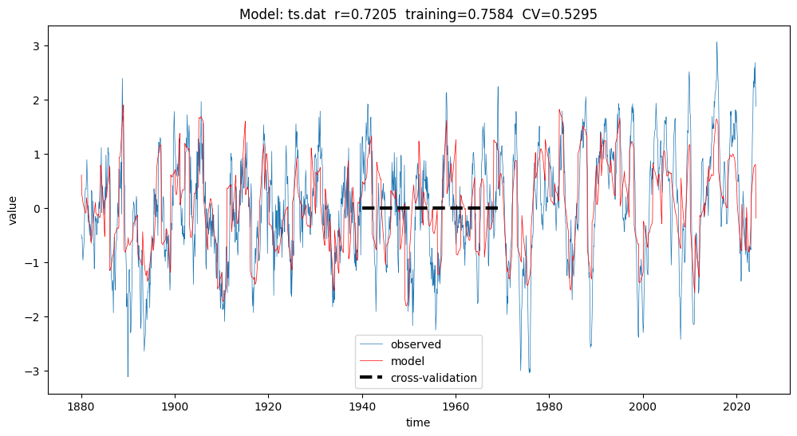

# LTE multiple linear regression on latent layers


---

## 📖 About


---

## 🛠️ How to Use


1. Clone this repository:


```
git clone https://github.com/pukpr/pukpr.github.io

$env:max_iters=3
$env:align=1
$env:PYPATH=".."

python3 ..\lte_mlr.py ts.dat --cc --random --low 1940 --high 1970

```


---

### NINO34


[config](nino34)


### NINO4



[config](nino4)





### {{ kw | upcase }}


[config]({{ kw }})




---

```
$name="2"
$name1=$name + "d"
cp data\$name1.dat .\$name\ts.dat
cp data\$name1.dat.p .\$name\ts.dat.p
cd $name
python3 ..\lte_mlr.py ts.dat --cc --random --low 1940 --high 1970
cd ..
cp nino34\index.md $name
```


